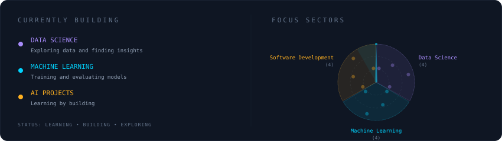

  

 

  

 

  

 

<strong>More about me</strong>

 

Third-year Computer Science student at ESTIN,
currently building my skills in Data Science and Machine Learning.

With a background in C, OOP, and frontend development,
I enjoy turning what I learn into practical projects.

